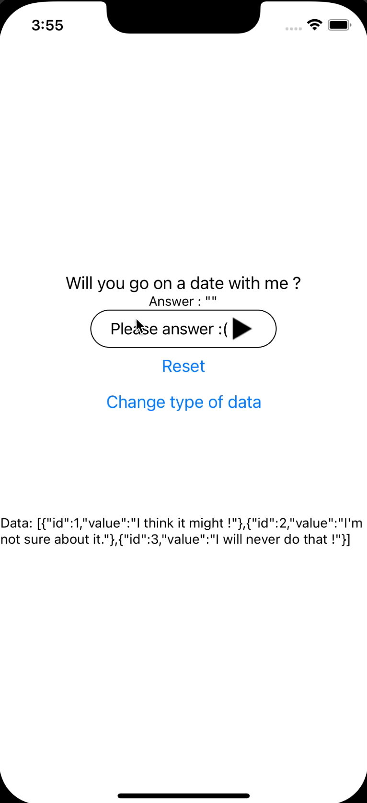
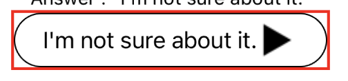
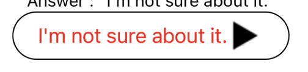
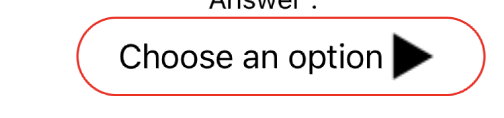
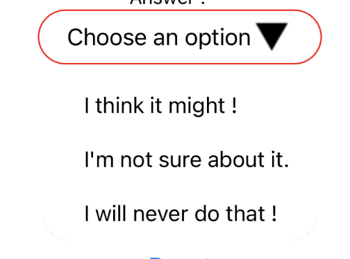
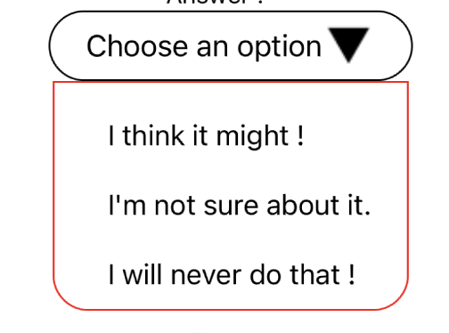
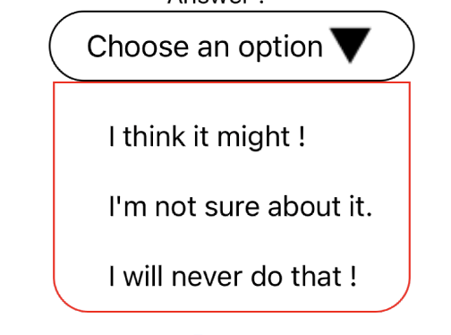
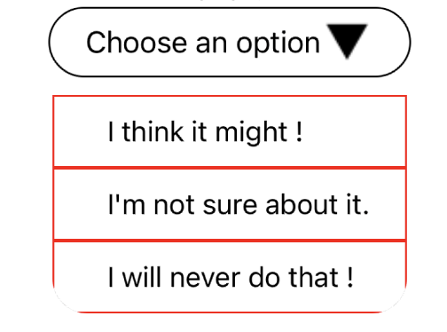
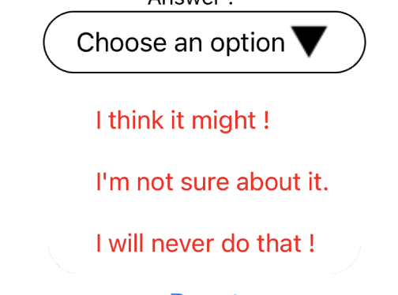

# react-native-simple-dropdown-picker

A simple, and fully customizable drop down picker.



# Installation

_Npm_
```
npm install react-native-simple-dropdown-picker
```
_Yarn_
```
yarn add react-native-simple-dropdown-picker
```

# Usage

You can see real example of `DropDownPicker` in the [test app](https://github.com/beeleethebee/react-native-dropdown-picker-test-app)  

```js
import DropDownPicker from 'react-native-simple-dropdown-picker';

const MySimpleComponent = () => {
	const [value, setValue] = useState('');
	const data = ['Hello', 'World'];
	return (
		<DropDownPicker
			result={value}
			setResult={setValue}
			data={data}
			placeholder={'Choose an option'}
		/>
	);	
}
```
___

# Config

## Props
| Name         | Type             | Default Value                                            | Description                                                                                     |
|--------------|------------------|----------------------------------------------------------|-------------------------------------------------------------------------------------------------| 
| result       | string or number | null                                                     | **(required)** State where you will place the result value picked (required)                    |
| setResult    | function         | null                                                     | **(required)** Function to mutate `result`                                                      |
| data         | array            | `[]`                                                     | **(required)** Possible value to result. Can be an array of value or an object like {id, value} |
| placeholder  | string           | First value of data                                      | Text to display if the value is not initialized                                                 |
| animatedIcon | component        | `<Image source={require('../assets/images/img.png')} />` | Component to display at the right of the text                                                   |

## Style Props
| Name                   | Default Value                                                                                                                                                           | Description                                                  | Screenshot                 |
|------------------------|-------------------------------------------------------------------------------------------------------------------------------------------------------------------------|--------------------------------------------------------------|----------------------------|
| wrapperStyle           | `{}`                                                                                                                                                                    | View wrapper                                                 |  |
| resultTextStyle        | `{fontSize: 17}`                                                                                                                                                        | Text display in the input box                                |                            |
| inputStyle             | `{borderRadius: 40, paddingHorizontal: 20,height: 40,flexDirection: 'row',justifyContent: 'space-between',alignContent: 'center',alignItems: 'center',borderWidth: 1,}` | Touchable Opacity for display the dropdown                   |                            |
| focusedInputStyle      | `{}`                                                                                                                                                                    | Style added on inputStyle when the dropdown is displayed ONLY |                            |
| flatListStyle          | `{flexGrow: 0,width: '90%',alignSelf: 'center',borderBottomRightRadius: 20,borderBottomLeftRadius: 20}`                                                                 | FlatList.style that contains the values of `data`            |                            |
| flatListContainerStyle | `{paddingTop: 10,borderBottomRightRadius: 20,borderBottomLeftRadius: 20}`                                                                                               | FlatList.contentContainerStyle for the dropdown              |                            |
| touchableStyle         | `{paddingHorizontal: 20,paddingVertical: 10,}`                                                                                                                          | TouchableOpacity that contain an extracted value of `data`   |                            |
| textStyle              | `{fontSize: 16,marginLeft: 10,}`                                                                                                                                         | Text that display an extracted value of `data`                |                            |
